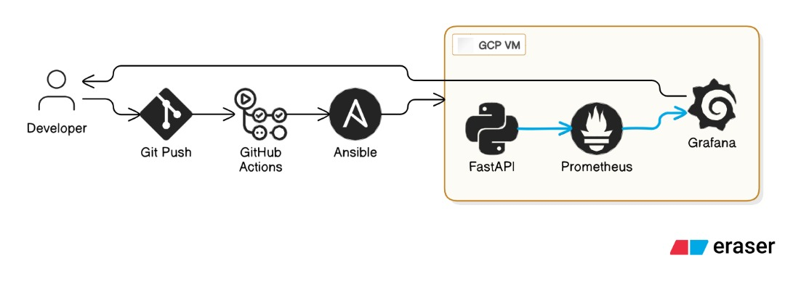

# Deployment of Python FastAPI to GCP with Monitoring (Prometheus/Grafana)

This project deploys a FastAPI using Docker Compose on a Google Cloud Platform VM with GitHub Actions and Ansible.


## FastAPI
The FastAPI written in Python exposes four(4) endpoints: "/", "/health", "/info" (for versioning), and "/metrics" for Prometheus scraping.

## Ansible Roles
Two Ansible roles were used for automation: __VM__ and __Docker__.

```bash
ansible-galaxy init docker vm --init_path ansible/roles
```
### Roles
- __VM__: Creates a VPC, a VM with a public IP and a disk, registers the VM's IP as the target for configuration, and configures SSH access to enable Ansible configuration.

-__Docker__: Installs Docker and Docker Compose. Runs the FastAPI, Prometheus and Grafana containers.

## GitHub Actions
For authentication, Workload Identity Federation links the Github Actions pipeline to my GCP project (_muchconsulting_). A service account was also created and granted appropriate permissions for execution of the pipeline

```bash
gcloud projects add-iam-policy-binding YOUR_PROJECT_ID \
  --member="serviceAccount:github-actions-sa@YOUR_PROJECT_ID.iam.gserviceaccount.com" \
  --role="roles/admin"
```

## Stress Test
To test Prometheus/Grafana monitoring, you can conduct stress testing using ApacheBench:

```bash
#!/bin/bash
ab -n 1000 -c 20 http://<VM_IP>/health
```


## Workflow
